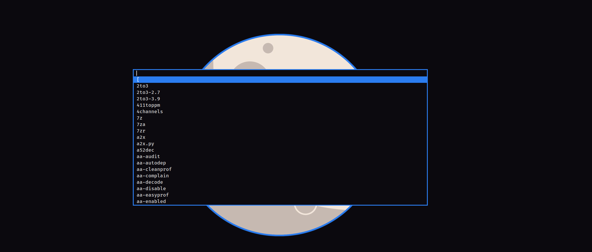

# Dalton Dmenu



>> In the screenshot, is [my pessoal Dmenu build](https://github.com/edersonferreira/dmenu-edersonferreira), if you want the same Dmenu, go to my repo [edersonferreira/dmenu-edersonferreira](https://github.com/edersonferreira/dmenu-edersonferreira)

# Install

# I don't have a Dmenu build

If you don't have a Dmenu build, this repository comes with a default dmenu config, so, clone the repo, and build the Dmenu.

```
cd /tmp
git clone https://github.com/edersonferreira/dalton-dmenu
cd dalton-dmenu
sudo make install
```

Now, you have a Dalton Dmenu!

# I alredy have a Dmenu build

if you alredy have your Dmenu config, only copy the colors:

```c
static const char *colors[SchemeLast][2] = {
	/*     fg         bg       */
	[SchemeNorm] = { "#DDDDDD", "#0C0A0F" },
	[SchemeSel] = { "#FFFFFF", "#2B7DF0" },
	[SchemeOut] = { "#000000", "#00FFFF" },
};
```

And replace in your Dmenu config. (`config.h` and `config.def.h`)
